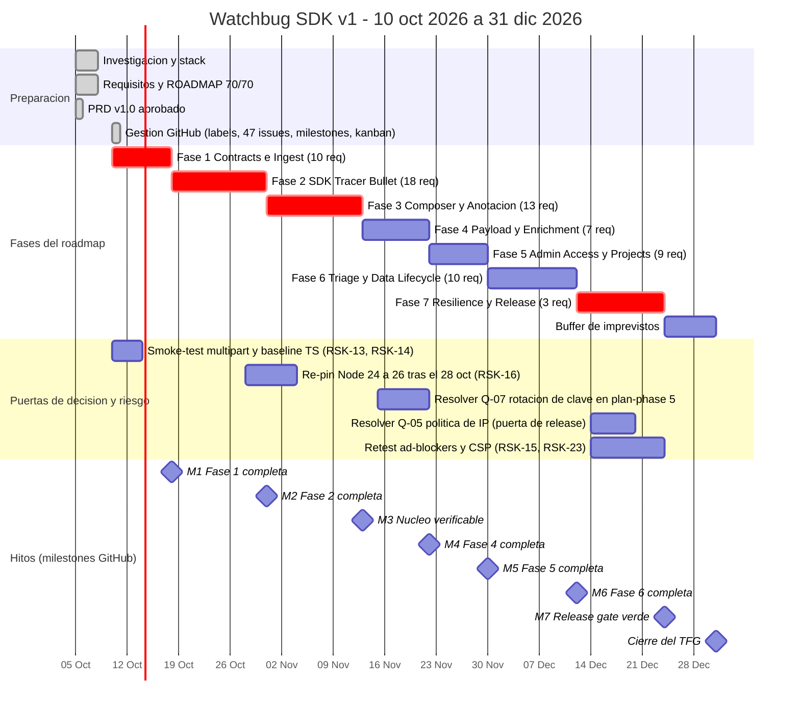

# Gantt — Watchbug SDK v1

> ## 🔒 LÍNEA BASE INMUTABLE
> Este documento es el **plan ideal de referencia**, creado el 2026-10-10 antes de empezar a ejecutar.
> **No se edita nunca**: ni fechas, ni alcance, ni barras. Su valor es poder compararse contra la realidad.
> El registro real y la variación viven en `documentation/Gantt-Actual.md` (se crea al cerrar la primera fase — ver `continuity-pack.md` §7).

Cronograma de cierre del proyecto: **10 oct → 31 dic 2026** (12 semanas).

Fuente de verdad de las fases y requisitos: `.planning/ROADMAP.md` · fechas = *due date* de los milestones de GitHub (`Phase 1` … `Phase 7`).
Generado: 2026-10-10 · sincronía GSD ↔ GitHub: `documentation/continuity-pack.md` §6.

---

## 1. Cronograma general

> La línea vertical es **hoy**. Las barras en rojo (`crit`) son las rutas sin margen: si una se retrasa, se come el buffer de Navidad.

---

## 2. Milestones, alcance e issues

| # | Milestone | Vence | Issues | Requisitos | Horas de calendario |
|---|-----------|-------|--------|------------|---------------------|
| 6 | Phase 1 — Contracts & Ingest Slice | **18 oct** | `#5`–`#10` (épica `#45`) | 10 | 8 días |
| 7 | Phase 2 — SDK Tracer Bullet | **31 oct** | `#11`–`#16` (épica `#46`) | 18 | 13 días |
| 8 | Phase 3 — Composer & Annotation *(núcleo verificable)* | **13 nov** | `#17`–`#23` (épica `#47`) | 13 | 13 días |
| 9 | Phase 4 — Payload & Enrichment | **22 nov** | `#24`–`#28` (épica `#48`) | 7 | 9 días |
| 10 | Phase 5 — Secure Admin Access & Projects | **30 nov** | `#29`–`#34` (épica `#49`) | 9 | 8 días |
| 11 | Phase 6 — Triage & Data Lifecycle | **12 dic** | `#35`–`#39` (épica `#50`) | 10 | 12 días |
| 12 | Phase 7 — Resilience & Release Closeout | **24 dic** | `#40`–`#44` (épica `#51`) | 3 + release gate | 12 días |
| — | **Buffer** | **25–31 dic** | — | — | 7 días |

---

## 3. Momentos críticos del calendario

| Fecha | Qué ocurre | Por qué importa |
|-------|------------|------------------|
| **18 oct** | M1 — Fase 1 | Primer hito, 8 días. Aquí se fijan `WidgetHost`, las constantes A-06 y el `check:size` multi-artefacto |
| **20 oct** | Node 24 entra en mantenimiento | `node:24.21.0-alpine3.24` sigue funcionando; solo es fecha límite del plan de re-pin |
| **28 oct** | Node 26 pasa a Active LTS | **Re-pin programado** (`RSK-16`) — ventana `d2` del diagrama, hacerlo en Fase 2, nunca más tarde |
| **31 oct** | M2 — Fase 2 | La más pesada: 18 requisitos, 13 días. Si se descuadra, arrastras todo noviembre |
| **13 nov** | **M3 — núcleo verificable** | Punto de no retorno: un informe real, enmascarado de forma irreversible, llega al panel. Lo anterior es preparación; lo posterior es pulido |
| **15–22 nov** | **Q-07** resuelta en `/gsd-plan-phase 5` | La rotación de clave (`#33`, *blocked*) no puede improvisarse en ejecución |
| **28 oct – 4 nov** | Re-pin Node 24 → 26 | Una sola re-pinned programada, hecha en Fase 2 |
| **14–20 dic** | **Q-05** — política de IP de la universidad | Sin esto **el repo no puede hacerse público** (R-07 Apache-2.0 + NOTICE) |
| **24 dic** | M7 — release gate verde | CA-01…CA-05 en chromium + firefox + webkit, `check:size`, compose limpio, cero secretos |
| **31 dic** | **Cierre TFG** | 7 días de buffer absorben cualquier desviación hasta aquí |

---

## 4. Reglas de lectura

1. **Ejecución estrictamente secuencial** (`ROADMAP.md`): 1 → 2 → 3 → 4 → 5 → 6 → 7. Cada fase depende de la anterior.
2. **Las barras *crit* no tienen margen propio** — su protección es el buffer del 25 al 31 de diciembre.
3. **Las puertas de decisión** (sección 2 del gráfico) no son trabajo, son espera: `#33` y `#44` están en estado `Blocked` del tablero hasta que se resuelvan.
4. **Sincronía al cierre de fase:** al verificar una fase se cierran juntas sus issues, la épica y el milestone (`continuity-pack.md` §6.5).
5. El calendario **no recorta alcance** (R-17): si algo no cabe, se mueve el calendario con el propietario, no se descuenta requisitos.

---
*Última actualización: 2026-10-10*
