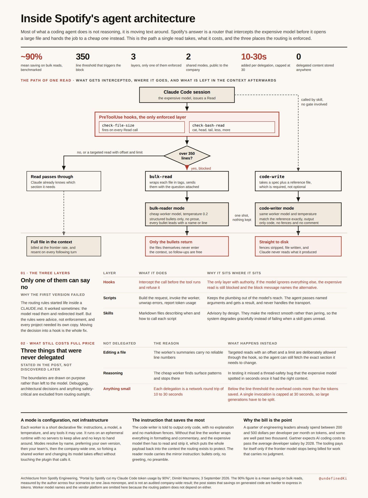
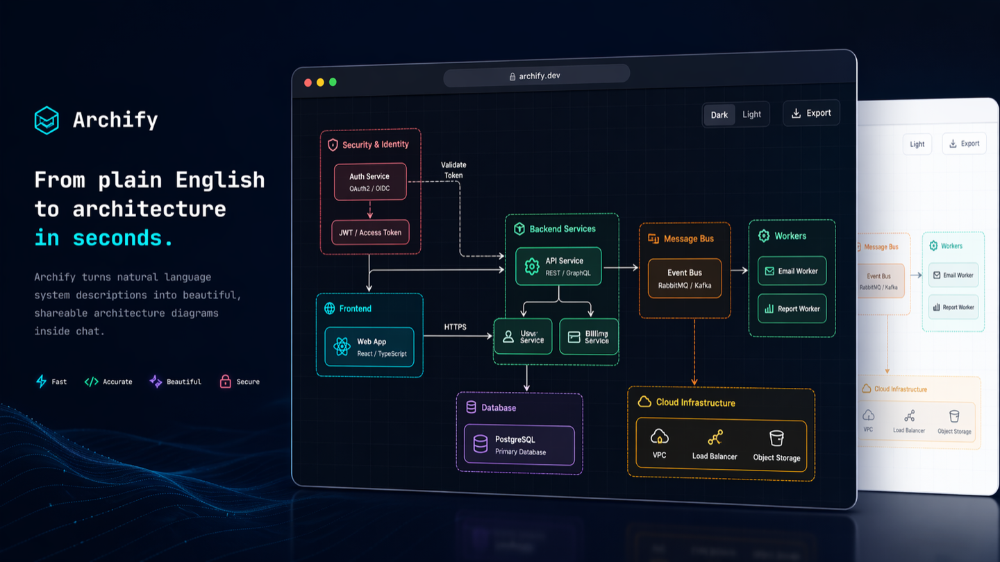
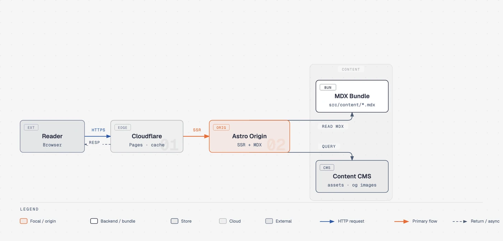
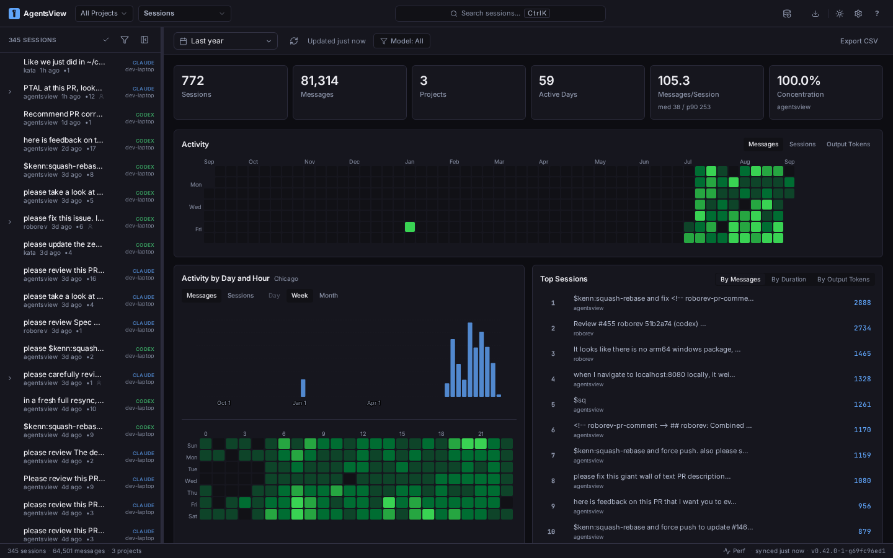
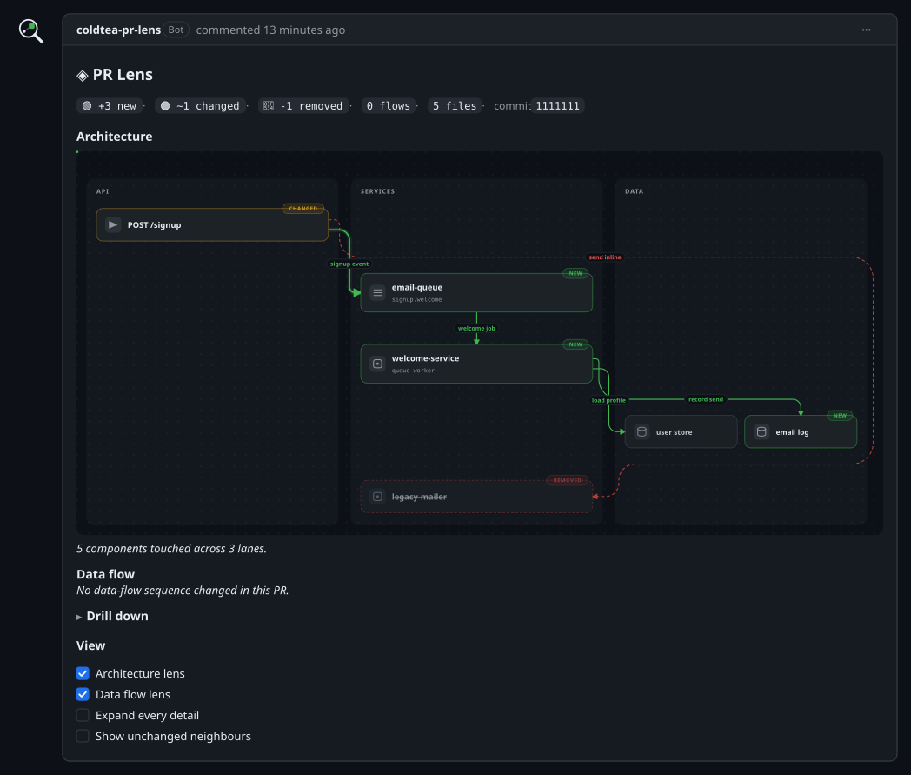

# Wiki de Ingeniería de IA y Desarrollo Asistido

Repositorio personal de recursos, herramientas, investigaciones y referencias para trabajar con agentes de IA de forma más fiable, verificable y profesional.

La colección ya no se limita a skills para agentes: también incluye fundamentos de ingeniería, calidad de código, observabilidad, revisión de cambios, arquitectura, diseño de interfaces, formación y contenido audiovisual.

## Historial de versiones

| Versión | Fecha | Cambios |
| --- | --- | --- |
| 1.4.0 | 2026-09-10 | Ampliación con Frontier Engineering, ripwire, AutoGen v0.4, Spotify y Claude Code, skills adicionales, curso de Andrew Ng, panel de YC sobre harnesses, guía VRAM para modelos locales y Opus Five. |
| 1.3.1 | 2026-09-04 | Incorporación de Rico UI Brands como recopilatorio de referencias visuales y design.md. |
| 1.3.0 | 2026-09-04 | Clasificación de Learn Harness Engineering como curso; traslado de Archify, Cyclomatic Complexity Skill y code-health-auditor al apartado Skills; separación de PR Lens en revisión de cambios. |
| 1.2.1 | 2026-09-04 | Ampliación de la tabla de contenidos con enlaces directos a los subapartados de cada categoría. |
| 1.2.0 | 2026-09-04 | Eliminación del mapa de recursos y reorganización de las entradas en categorías principales con subapartados. |
| 1.1.0 | 2026-09-04 | Reestructuración completa por categorías; incorporación de investigación, recursos de diseño, formación, Gentle-AI, AgentsView, PR Lens y Sona UI. |
| 1.0.0 | 2026-09-01 | Primera recopilación de skills y herramientas para agentes. |

## Tabla de contenidos

1. [Artículos e investigación](#artículos-e-investigación)
	- [AI Engineering Skills Map: Software Engineering Fundamentals](#ai-engineering-skills-map-software-engineering-fundamentals)
	- [The End of Software Engineering](#the-end-of-software-engineering-how-ai-agents-are-fundamentally-restructuring-the-software-paradigm)
	- [Frontier Engineering](#frontier-engineering)
	- [AutoGen v0.4: Arquitectura de tres capas para agentes multi-agente](#autogen-v04-arquitectura-de-tres-capas-para-agentes-multi-agente)
	- [Spotify y Claude Code: optimización de tokens](#spotify-y-claude-code-optimización-de-tokens)
	- [ripwire: contexto de repositorio sin embeddings](#ripwire-contexto-de-repositorio-sin-embeddings)
2. [Skills](#skills)
	- [Humanizer](#humanizer)
	- [SwarmForge](#swarmforge)
	- [Gentle-AI](#gentle-ai)
	- [Gentle-Pi](#gentle-pi)
	- [Archify](#archify)
	- [Cyclomatic Complexity Skill](#cyclomatic-complexity-skill)
	- [code-health-auditor](#code-health-auditor)
	- [diagram-design](#diagram-design)
	- [council](#council)
	- [Agent Reach](#agent-reach)
	- [i-have-adhd](#i-have-adhd)
	- [wait-what](#wait-what)
	- [show-me](#show-me)
	- [PageSpeed Optimization](#pagespeed-optimization)
3. [Cursos](#cursos)
	- [Learn Harness Engineering](#learn-harness-engineering)
	- [Complete Harness Engineering (Andrew Ng)](#complete-harness-engineering-andrew-ng)
4. [Calidad](#calidad)
	- [stopthatslop](#stopthatslop)
5. [Observabilidad](#observabilidad)
	- [AgentsView](#agentsview)
6. [Revisión de cambios](#revisión-de-cambios)
	- [PR Lens](#pr-lens)
	- [Self-Evolving Code Review Agent](#self-evolving-code-review-agent)
7. [Design](#design)
	- [Skills for Designers and Engineers](#skills-for-designers-and-engineers)
	- [Make Interfaces Feel Better](#make-interfaces-feel-better)
	- [12 Principles of Animation](#12-principles-of-animation)
	- [Fixing Accessibility](#fixing-accessibility)
	- [shadcn](#shadcn)
	- [Sona UI](#sona-ui)
	- [Recursos de diseño Design.md](#recursos-de-diseño-designmd)
	- [Rico UI Brands](#rico-ui-brands)
8. [Formación](#formación)
	- [Todo lo que necesitas saber sobre la Ingeniería de IA en 26 minutos](#todo-lo-que-necesitas-saber-sobre-la-ingeniería-de-ia-en-26-minutos)
	- [Panel YC: el estado de los harnesses](#panel-yc-el-estado-de-los-harnesses)
9. [Guías de referencia](#guías-de-referencia)
	- [Guía de modelos por VRAM](#guía-de-modelos-por-vram)
10. [Casos de uso y exploración](#casos-de-uso-y-exploración)
	- [Opus Five](#opus-five)
11. [Índice de enlaces](#índice-de-enlaces)
12. [Conclusión](#conclusión)

## Artículos e investigación

### AI Engineering Skills Map: Software Engineering Fundamentals

Publicación de [Andrew Ng en X](https://x.com/AndrewYNg/status/2093388974194872781), tipo mapa de habilidades y referencia formativa.

Presenta un mapa de habilidades de ingeniería de IA centrado en los fundamentos de la ingeniería de software. Trabajar con IA no elimina la necesidad de dominar las bases: diseño, programación, pruebas, control de versiones, depuración, arquitectura y mantenimiento.

Orienta el aprendizaje de ingeniería de IA, detecta qué conocimientos técnicos conviene reforzar, y evita reducir la ingeniería de IA a escribir prompts o generar código.

### The End of Software Engineering: How AI Agents Are Fundamentally Restructuring the Software Paradigm

Artículo académico de [Zhenfeng Cao](https://arxiv.org/html/2606.05608v1) (Lingxi Intelligent Investment, Shenzhen), versión v1 del 24 de agosto de 2026.

#### Tesis principal

El artículo sostiene que la aparición de agentes de IA no es solo una mejora incremental de las herramientas de desarrollo. Modifica el paradigma del software: el código deja de ser necesariamente el portador permanente de toda la lógica de decisión y puede convertirse en una herramienta temporal dentro de un ciclo de razonamiento dirigido por un modelo de lenguaje.

Contrasta el software tradicional, donde los ingenieros codifican reglas estáticas, con los sistemas agénticos, donde el agente planifica, genera código, utiliza herramientas, observa resultados y adapta sus siguientes acciones.

#### Conceptos principales

- **Software tradicional:** sistema basado en recursos computacionales, reglas deterministas y un entorno de ejecución.
- **Sistema agéntico:** combinación de modelo de lenguaje, herramientas ejecutables, memoria y planificación.
- **AaaS, Agent-as-a-Service:** evolución propuesta desde el software local y el SaaS hacia servicios que entregan resultados operados por agentes.
- **Agentic Engineering:** disciplina emergente centrada en diseñar, coordinar, observar y auditar sistemas de agentes.
- **Intent architect:** persona que expresa objetivos, restricciones y criterios de éxito.
- **Outcome auditor:** persona o mecanismo que verifica que el resultado cumple la intención.

#### Evolución propuesta

| Etapa | Modelo | Papel humano |
| --- | --- | --- |
| I. Tool-Augmented | El agente ayuda con tareas concretas | Autor y revisor |
| II. Single-Task Autonomous | El agente completa tareas de principio a fin | Arquitecto de intención y auditor |
| III. Multi-Agent Teams | Varios agentes especializados colaboran | Product manager, arquitecto y auditor |
| IV. Self-Evolving Ecosystems | Los agentes se adaptan y mejoran sus propios sistemas | Definidor de objetivos y gobernador ético |

#### Evidencia y límites

El artículo cita resultados de SWE-bench Verified, EvoClaw y estudios de coordinación multi-agente. Una de sus advertencias centrales es la diferencia entre resolver tareas aisladas y mantener un sistema durante una evolución prolongada. El rendimiento puede superar el 80 % en tareas aisladas y caer hasta un 38 % en escenarios continuos, donde se acumulan errores y deuda técnica.

Los retos que destaca:

- Deriva de contexto en repositorios grandes.
- Propagación de errores entre cambios sucesivos.
- Poca conciencia del coste de la deuda técnica.
- Verificación insuficiente frente a errores semánticos.
- Dificultad para alinear equipos de agentes con objetivos humanos.

#### Lectura crítica

Fuente útil para debatir hacia dónde puede evolucionar la ingeniería de software, pero sus afirmaciones prospectivas deben distinguirse de sus resultados empíricos. La propia diferencia entre tareas aisladas y evolución continua refuerza una conclusión práctica: los agentes necesitan memoria, observabilidad, pruebas y control humano para trabajar de forma fiable.

### Frontier Engineering

Guía práctica de [Kiro](https://kiro.dev/topics/frontier-engineering/) para profesionales.

Describe una división emergente en el desarrollo de software: quienes han cambiado cómo trabajan con agentes de IA frente a quienes solo cambiaron sus herramientas de código. Los agentes pueden escribir código, ejecutar pruebas, corregir fallos e iterar durante horas sin intervención humana. El rol del desarrollador pasa de construir software directamente a construir la configuración del agente que construye el software.

Ideas clave:

- Las ganancias de productividad no vienen de mejores herramientas de coding, sino de trabajar de forma diferente.
- Requiere inversión de semanas: escribir archivos de steering, refactorizar el codebase, aprender a descomponer tareas para agentes.
- Las primeras semanas se sienten más lentas; después, la velocidad aumenta drásticamente.

La productividad con agentes no es instantánea sino un proceso de adaptación del flujo de trabajo.

### AutoGen v0.4: Arquitectura de tres capas para agentes multi-agente

[Framework de Microsoft](https://github.com/microsoft/autogen) para sistemas multi-agente. Fuente: [publicación en X](https://x.com/marfinxx/status/2096206860781031528).

> 📹 **Vídeo demostrativo:** [Ver en X →](https://x.com/marfinxx/status/2096206860781031528/video/1) — Arquitectura de tres capas de AutoGen v0.4 en acción.

Microsoft reescribió AutoGen desde cero (v0.4) para demostrar que construir agentes de IA escalables requiere separación arquitectónica en tres capas:

| Capa | Componente | Función |
| --- | --- | --- |
| Harness | autogen-core | Runtime asíncrono basado en actores, paso de mensajes tipado, pub-sub y RPC |
| Loop | autogen-agentchat | Coordinación explícita de equipos y condiciones de terminación obligatorias |
| Graph | Team Topologies | Enrutamiento dinámico en tiempo de ejecución mediante handoffs Swarm, SelectorGroupChat y Magentic-One |

Magentic-One añade orquestación centralizada con ledger de tareas inmutable, grafo causal dinámico y un bucle externo auto-corrector que detecta fallos, resetea estado y re-planifica sin intervención humana.

Referencia arquitectónica para construir sistemas multi-agente fiables y escalables.

### Spotify y Claude Code: optimización de tokens

[Caso de uso práctico](https://x.com/undefinedKi/status/2095942506433089832) de optimización de costes.

Spotify publicó la configuración interna que sus ingenieros usan con Claude Code, reduciendo el consumo de tokens en un 90%. La estrategia consiste en añadir dos asistentes baratos: uno que abre archivos y devuelve un resumen, otro que escribe código repetitivo basándose en ejemplos. El modelo caro solo se usa para edits y para detectar bugs que el modelo barato se pierde.

Mecanismo de enforcement: las reglas escritas como instrucciones las ignoraba el modelo; ahora cualquier cosa mayor de 350 líneas se bloquea antes de abrirla y se envía al modelo barato. Las reglas escritas son sugerencias; un bloqueo no lo es.

Demostración práctica de cómo combinar modelos baratos y caros para reducir costes sin perder calidad.

### ripwire: contexto de repositorio sin embeddings

[Herramienta de Red Hat Emerging Technologies](https://github.com/redhat-et/ripwire). Fuente: [publicación en X](https://x.com/agenticgirl/status/2096612794145911260).

Binario C++23 de dependencia cero que parsea 21 lenguajes con Tree-sitter y construye un mapa estructural determinista de un repositorio. Clasifica símbolos por relevancia para una tarea, adjuntando relaciones de llamada, complejidad, churn en git, amplificación de cambios y cobertura de tests.

Un agente puede preguntar por símbolos relevantes para una tarea específica y recibir los símbolos, sus llamantes, radio de impacto probable y tests a ejecutar en una respuesta con presupuesto de tokens, en lugar de grepear y abrir archivos repetidamente.

Alternativa a embeddings y bases de vector para dar contexto de repositorio a agentes.

## Skills

### Humanizer

[GitHub: blader/humanizer](https://github.com/blader/humanizer), skill Markdown para agentes.

Humanizer reescribe texto con tono artificial para que suene más natural sin cambiar su significado. Usa 35 patrones inspirados en [Signs of AI writing](https://en.wikipedia.org/wiki/Wikipedia:Signs_of_AI_writing), mantenidos por WikiProject AI Cleanup.

#### Cómo funciona

1. Hace una primera reescritura sin tratar la estructura original como inamovible.
2. Comprueba el resultado frente a los patrones y las afirmaciones originales.
3. Reescribe lo que aún suene artificial.

No inventa nombres, números, fechas, citas ni referencias. Mantiene el estilo del autor en textos personales y utiliza una prosa neutral en textos técnicos. Al trabajar sobre un archivo, modifica solo la prosa: deja intactos el código, los datos, el frontmatter y los destinos de los enlaces.

Útil para documentación, mensajes, resúmenes, correo y textos producidos por agentes.

### SwarmForge

[GitHub: unclebob/swarm-forge](https://github.com/unclebob/swarm-forge), plataforma de coordinación multi-agente.

SwarmForge coordina agentes que trabajan en distintos worktrees de Git. Proporciona una estructura para roles, asignación de trabajo, sesiones tmux y mensajería entre agentes.

Aporta organización por roles, separación del trabajo mediante worktrees, sesiones persistentes con tmux, comunicación compartida y plantillas reutilizables para proyectos complejos.

La rama principal es principalmente documental y contiene scripts operativos y artículos de constitución. Las ramas *pack* sirven como plantillas que pueden instalarse y convertirse en nuevos proyectos.

### Gentle-AI

[Repositorio](https://github.com/Gentleman-Programming/gentle-ai) · [Web](https://gentle-ai.gentlemanprogramming.com/) · [Wiki](https://gentle-ai-wiki.gentlemanprogramming.com/). Configurador de ecosistemas para agentes.

Gentle-AI configura el runtime de agente que ya existe en el equipo. No instala silenciosamente un agente que no esté presente. Añade componentes para que el agente deje de empezar desde cero en cada sesión.

Componentes principales:

- Memoria persistente mediante Engram.
- Biblioteca de skills.
- Workflows de planificación y Spec-Driven Development (SDD).
- Servidores MCP, incluido Context7.
- Enrutamiento de modelos.
- Persona orientada a la enseñanza.
- Permisos y guardrails de seguridad.
- Revisión opcional basada en evidencia mediante Receipt-Driven Development (RDD).

Funciona con distintos runtimes, entre ellos Claude Code, OpenCode, Kilo Code, Gemini CLI, Cursor, VS Code Copilot, Codex, Windsurf, Antigravity, OpenClaw y otros. Las capacidades dependen del agente seleccionado.

Idea destacada: el agente debe elegir la ruta de trabajo adecuada según la ambigüedad y el tipo de tarea. Las tareas pequeñas pueden resolverse directamente; las propuestas, especificaciones y diseños duraderos se reservan para trabajos donde realmente reducen la ambigüedad.

Requiere que el runtime de IA elegido ya esté instalado. Incluye copias de seguridad, sincronización de assets y un comando `doctor` de diagnóstico. RDD es opcional y está desactivado por defecto.

### Gentle-Pi

[GitHub: Gentleman-Programming/gentle-pi](https://github.com/Gentleman-Programming/gentle-pi/releases/tag/v2.5.0), extensión visual y de agentes para Pi.

Gentle-Pi v2.5.0 convierte a Pi en el agente del ecosistema Gentle AI. Añade una capa visual y de agentes nativa sobre Pi sin modificar su código fuente. Incluye una línea de estado con proyecto, branch, modelo, effort y medidor de contexto que cambia de color al 80% y 95%.

Componentes principales:

- Gentle Shell: interfaz visual con cards de cada llamada a gentle-ai (ámbar corriendo, verde terminó, rojo falló). Alt+g abre el diff de cambios.
- Gentle Agents: subagentes nativos aislados, cada uno con su card de tarea, modelo, tokens, costo y tiempo. Todo queda en disco: historia, sesiones hijas y transcript markdown.
- Gentle Todo: propio sistema de tareas con el mismo lenguaje de cards.
- Delegación consciente del riesgo: el orquestador lee el switch de receipt-driven development antes de delegar; cuando está apagado, decide si el cambio merece un verificador aparte.

Instalación: `pi install npm:gentle-pi@2.5.0` (y después `/gentle:install-sdd --force`)

### Archify

[GitHub: tt-a1i/archify](https://github.com/tt-a1i/archify), skill para generar y validar diagramas.

Archify transforma una base de código o una descripción de sistema en mapas interactivos de arquitectura, workflow, secuencia, flujo de datos y ciclo de vida.

Genera una representación intermedia tipada en JSON y la compila de forma determinista a HTML/SVG. Incluye búsqueda de nodos, trazado de rutas, revisión de fuentes, comparación de snapshots y exportación a HTML, PNG, SVG, WebM y tarjetas de presentación.

Casos de uso: revisar arquitectura antes de un merge, entender dependencias y comparar estados antes y después de una refactorización.

### Cyclomatic Complexity Skill

[GitHub: cyclomatic-complexity-skill](https://github.com/saurabhkumar8112/cyclomatic-complexity-skill/tree/master), skill de análisis y refactorización.

Mide la complejidad ciclomática por función y ayuda a refactorizar primero los puntos más difíciles de mantener. Puede apoyarse en radon, ESLint, gocyclo, lizard o un conteo manual.

Técnicas habituales: guard clauses, extracción de funciones, tablas de búsqueda (*lookup tables*), predicados con nombres claros.

La skill evita engañar a la métrica trasladando la complejidad a funciones peor nombradas. Termina con una comparación de complejidad antes y después.

### code-health-auditor

[GitHub: smith-horn/code-health-auditor](https://github.com/smith-horn/code-health-auditor), skill de auditoría estructural y arquitectónica.

Evalúa la salud general de un repositorio, con especial atención a la mantenibilidad, la deuda técnica, las reexportaciones y la organización modular.

Incluye patrones de calibración para identificar problemas de dependencias y archivos *barrel* en TypeScript. También propone scripts de escaneo y verificación, como `scan-repo.sh` y `verify-candidates.sh`, para separar candidatos de problemas confirmados.

Diferencia frente a `stopthatslop`: este se centra más en reglas técnicas y antipatrones concretos; `code-health-auditor` observa la salud estructural y la evolución de la arquitectura.

### diagram-design

[GitHub: cathrynlavery/diagram-design](https://github.com/cathrynlavery/diagram-design), skill para generar diagramas.

Genera 39 tipos de diagramas. Cada uno sale como un archivo HTML que se puede abrir con doble clic. Útil para visualizar arquitectura, flujos, secuencias y estructuras de datos sin dependencias externas.

### council

[GitHub: kitze/council](https://github.com/kitze/council), skill de validación colaborativa.

Antes de que el agente dé un plan, tiene que preguntar a cada otro agente CLI en la máquina qué está mal con él. Revisión cruzada entre agentes para mejorar la calidad de las propuestas antes de ejecutarlas.

### Agent Reach

[GitHub: Panniantong/Agent-Reach](https://github.com/Panniantong/Agent-Reach), integrador multi-plataforma.

Conecta con 15 plataformas, 9 de ellas detrás de login o API key. Selecciona el backend adecuado para cada una, lo instala y告诉你 cuál está activo. Útil para automatizar interacciones con servicios que requieren autenticación.

### i-have-adhd

[GitHub: ayghri/i-have-adhd](https://github.com/ayghri/i-have-adhd), skill anti-pérdida de foco.

Evita que el agente se pierda en divagaciones. Publica un eval harness y publica el gate donde su propia skill falla. Fuerza al agente a entregar la respuesta directamente sin rodeos.

### wait-what

[GitHub: mattpocock/skills/tree/main/skills/productivity/wait-what](https://github.com/mattpocock/skills/tree/main/skills/productivity/wait-what), skill de re-explicación.

394 bytes. Se escribe cuando un mensaje no llegó a entenderse, y el agente reformula la explicación de otra forma. Minimalista pero efectivo para desambiguar.

### show-me

[GitHub: humanlayer/humanlayer](https://github.com/humanlayer/humanlayer), skill de visualización.

Ayuda a entender el tema de conversación visualmente mediante diagramas, pseudocódigo, árboles de componentes, grafos Mermaid y diffs. Genera un archivo HTML enfocado que abre en el navegador. Evita la explicación textual extensa cuando una imagen aclara más.

### PageSpeed Optimization

[GitHub: YankielDBC2/pagespeed-optimization](https://github.com/YankielDBC2/pagespeed-optimization), skill de optimización web.

Optimiza sitios web enfocado en mejorar métricas de rendimiento y PageSpeed. Útil cuando se necesita auditar y acelerar el rendimiento de una aplicación web.

## Cursos

### Learn Harness Engineering

[GitHub: walkinglabs/learn-harness-engineering](https://github.com/walkinglabs/learn-harness-engineering), curso basado en proyectos.

Enseña a construir el entorno, la gestión de estado, la verificación y los mecanismos de control que permiten que los agentes de IA trabajen con fiabilidad.

Temas principales: construcción del entorno de trabajo, gestión del estado y del contexto, verificación de resultados, control y supervisión, diseño de flujos para coding agents.

La idea central es que muchos fallos de los agentes no proceden únicamente del modelo, sino de la infraestructura que lo rodea.

### Complete Harness Engineering (Andrew Ng)

[Publicación en X](https://x.com/iiiichigo_chan/status/2095911936579805682), curso gratuito de 2 horas.

Curso de Andrew Ng sobre harness engineering completo. Enseña a pasar de un solo prompt a un sistema confiable de agentes que pueden ejecutar, probar y mejorar por sí mismos.

Contenido: construcción del primer agente desde cero, dominio de bucles de agente, convertir bucles en flujos de trabajo confiables, construir agentes que mejoren su propio trabajo, ejecutar el sistema completo sin supervisión.

La mayoría de tutoriales de agentes terminan cuando el modelo puede llamar a una herramienta. Este curso muestra cómo construir la infraestructura alrededor en los primeros 20 minutos: harnesses que dan a los agentes contexto, herramientas, tests y feedback.

## Calidad

### stopthatslop

[Web](https://stopthatslop.com/) · [GitHub](https://github.com/StopThatSlop/stopthatslop). Validador de calidad y detector de malas prácticas.

Analiza código generado automáticamente o escrito de forma descuidada mediante reglas técnicas y analizadores AST para ecosistemas como Java/Spring, Python/FastAPI, Go y TypeScript/Node.

Puede ayudar a detectar: consultas SQL inseguras, manejo incorrecto de excepciones, peticiones HTTP sin tiempos de espera, logs que exponen datos personales, antipatrones de arquitectura y problemas de mantenibilidad, vulnerabilidades antes de que lleguen a producción.

Funciona como un *guardrail* técnico para poner un filtro de calidad entre la generación del código y su integración.

## Observabilidad

### AgentsView

[Web](https://www.agentsview.io/) · [GitHub](https://github.com/kenn-io/agentsview). Sistema local-first de archivo, búsqueda y analítica de sesiones.

Reúne sesiones de más de 60 formatos de agentes en un archivo local consultable. Permite explorar transcripciones, actividad, costes, calidad y memoria sin crear una cuenta.

Características:

- Búsqueda de texto completo y búsqueda semántica opcional.
- Navegador de sesiones y de conversaciones.
- Seguimiento de tokens y costes por sesión y modelo.
- Analítica de actividad, herramientas, velocidad y proyectos.
- Feed de archivos modificados recientemente.
- Exportación de sesiones a HTML o GitHub Gist.
- Actualizaciones en vivo mediante SSE.
- Backend local con SQLite y opciones de espejo o sincronización con PostgreSQL y DuckDB.
- Soporte para numerosos agentes, como Claude Code, Codex, Cursor, Copilot CLI, Gemini CLI, OpenCode, Aider y otros.

Por defecto, los datos permanecen en la máquina local y el servidor se enlaza a `127.0.0.1`. La telemetría anónima de actividad del daemon puede desactivarse.

Convierte las sesiones en evidencia recuperable. Esto ayuda a revisar qué hizo el agente, cuánto costó, qué archivos cambió y qué decisiones se tomaron.

## Revisión de cambios

### PR Lens

[GitHub: coldteadotai/pr-lens](https://github.com/coldteadotai/pr-lens) · [prlens.dev](https://prlens.dev/). GitHub App, GitHub Action, CLI y skill para agentes.

Dibuja cada pull request como diagramas animados de arquitectura y flujo de datos, publicados dentro de la propia PR. Su objetivo es permitir entender el impacto del cambio antes de leer todo el diff.

Características:

- Mapa del *blast radius* arquitectónico.
- Rutas de datos animadas en orden de ejecución.
- Vistas anidadas para profundizar en una parte de la PR.
- Colores para diferenciar elementos nuevos, modificados y eliminados.
- Correcciones persistentes mediante `.github/pr-lens.yml`.
- Renderer determinista basado en un contrato de grafo.
- Ejecución como App, Action, CLI o skill del agente.

El repositorio requiere Node.js 20.11 o superior y pnpm 10 para desarrollo. Está publicado bajo licencia MIT.

### Self-Evolving Code Review Agent

[GitHub: Sumanth077/Hands-On-AI-Engineering](https://github.com/Sumanth077/tree/main/ai_agents/self_evolving_code_review_agent). Agente de revisión de código con memoria experencial persistente.

La mayoría de agentes de revisión usan el mismo prompt cada vez. Este proyecto añade memoria experencial al bucle de revisión: antes de cada review, el agente recupera reglas del equipo y trayectorias de revisiones pasadas similares. Después, el ingeniero acepta, rechaza o edita cada comentario, y esa retroalimentación se convierte en la señal de aprendizaje.

**Bucle de trabajo:**

- **Retrieve:** busca en memoria reglas relevantes y revisiones pasadas similares antes de generar comentarios.
- **Review:** genera feedback estructurado usando el diff actual más la memoria recuperada.
- **Human feedback:** pausa el workflow y recopila una decisión de aceptar, rechazar o editar por cada comentario.
- **Reflect:** convierte esas decisiones en reglas reutilizables en lenguaje natural con rationale, polaridad, scope y confianza.
- **Persist:** almacena tanto los insights aprendidos como la trayectoria completa de la revisión para futuras recuperaciones.

El agente se adapta de forma no paramétrica: en lugar de fine-tuning del modelo, mejora almacenando resultados de revisión como memoria reutilizable. Funciona localmente con LangGraph, Ollama, BGE embeddings y una base de datos vectorial.

## Design

### Skills for Designers and Engineers

[GitHub: emilkowalski/skills](https://github.com/emilkowalski/skills/tree/main), colección de skills de diseño.

Reúne conocimientos prácticos para diseñadores e ingenieros que trabajan con interfaces y animaciones. Su propósito es acelerar decisiones de diseño sin sustituir la experiencia de dominio.

Aporta criterios para evaluar animaciones, orientación sobre diseño de interfaces, reglas basadas en experiencia profesional en productos como Vercel y Linear, y una forma de convertir expertise de diseño en instrucciones reutilizables por agentes.

### Make Interfaces Feel Better

[ui-skills.com: jakubkrehel/make-interfaces-feel-better](http://ui-skills.com/skills/jakubkrehel/make-interfaces-feel-better). Skill de diseño de ingeniería para interfaces.

Enfocado en hacer que las interfaces se sientan pulidas y profesionales. Cubre principios de diseño visual, micro-interacciones, espaciado, tipografía y composición para que los agentes generen interfaces con buen gusto visual.

### 12 Principles of Animation

[ui-skills.com: raphaelsalaja/12-principles-of-animation](http://ui-skills.com/skills/raphaelsalaja/12-principles-of-animation). Skill de animación para interfaces.

Los 12 principios de animación de Disney aplicados a interfaces web. Útil cuando se necesita crear transiciones, enter/exit animations y micro-interacciones que se sientan naturales y fluidas.

### Fixing Accessibility

[ui-skills.com: ibelick/fixing-accessibility](http://ui-skills.com/skills/ibelick/fixing-accessibility). Skill de accesibilidad web.

Detecta y corrige problemas de accesibilidad en interfaces. Cubre ARIA labels, contraste de color, navegación por teclado, soporte para screen readers y otros requisitos WCAG. Complementa la auditoría de accesibilidad con reglas prácticas para agentes.

### shadcn

[ui-skills.com: shadcn-ui/shadcn](http://ui-skills.com/skills/shadcn-ui/shadcn). Skill del ecosistema shadcn/ui.

Reglas y patrones para trabajar con componentes shadcn/ui de forma correcta. Incluye convenciones de uso, composición de componentes, patrones de diseño y integración con Tailwind CSS. Útil cuando se genera código que usa este ecosistema de componentes.

### Sona UI

[sona-ui.vercel.app](https://sona-ui.vercel.app/), librería de componentes React y Tailwind CSS.

Los componentes se distribuyen mediante un registro compatible con shadcn, de modo que se pueden inspeccionar, adaptar y ajustar a cada producto. El código fuente pertenece al proyecto que lo instala.

Recursos:

- [Catálogo de componentes](https://sona-ui.vercel.app/agent/catalog.json)
- [Instalación](https://sona-ui.vercel.app/docs/installation)
- [Uso con IA](https://sona-ui.vercel.app/docs/use-with-ai)
- [Índice del registro](https://sona-ui.vercel.app/r/registry.json)
- [Guía para agentes](https://sona-ui.vercel.app/llms.txt)

Útil cuando se quiere que un agente trabaje con componentes accesibles y adaptables sin tratar la librería como una caja negra.

### Recursos de diseño Design.md

Directorio de sitios de inspiración y recursos visuales.

Lista recopilada para consultar recursos relacionados con interfaces, tipografía, composición, sistemas visuales y diseño web:

- [Refero](https://styles.refero.design)
- [Designmd](https://designmd.me)
- [Open Design](https://open-design.ai)
- [Design.md Supply](https://designmd.supply)
- [getdesign.md](https://getdesign.md)
- [Aura](https://aura.build)
- [Neuform](https://neuform.ai)
- [Design.md de Hyperbrowser](https://design-md.hyperbrowser.ai)
- [TypeUI](https://typeui.sh)

### Rico UI Brands

[Rico UI Brands](https://design.ricoui.com/brands), recopilatorio de referencias de marca e interfaces con fichas de design.md.

Reúne decenas de marcas y productos para estudiar cómo resuelven su identidad visual en la web. Cada referencia incluye una descripción del lenguaje visual, tipografía, paleta, composición, componentes y otros rasgos del sistema de diseño, además de etiquetas para filtrar por sector, tema visual y estilo de interfaz.

Útil para buscar referencias antes de crear una interfaz, comparar decisiones visuales de marcas de distintos sectores, dar a un agente contexto visual concreto mediante una ficha de design.md, y analizar patrones de tipografía, color, espaciado, componentes e imágenes.

## Formación

### Todo lo que necesitas saber sobre la Ingeniería de IA en 26 minutos

[YouTube](https://www.youtube.com/watch?v=kIbr5lN-2F8), vídeo introductorio.

Referencia audiovisual para obtener una visión general de la ingeniería de IA en un formato breve. Puede servir como punto de entrada antes de estudiar en profundidad agentes, herramientas, evaluación, memoria, observabilidad y despliegue.

  <iframe
    src="https://www.youtube.com/embed/kIbr5lN-2F8"
    style={{position: 'absolute', top: 0, left: 0, width: '100%', height: '100%', border: 0}}
    allow="accelerometer; autoplay; clipboard-write; encrypted-media; gyroscope; picture-in-picture"
    allowFullScreen
    title="Ingeniería de IA en 26 minutos"
  />

### Panel YC: el estado de los harnesses

[Publicación en X](https://x.com/ycombinator/status/2096970626036855197), panel de discusión con investigadores y fundadores.

Moderado por Y Combinator, reúne a investigadores y fundadores trabajando en la frontera para analizar el estado actual de los harnesses de agentes. El punto de partida: harnesses a menudo se descartan como mero scaffolding o prompt engineering, pero los mismos pesos de modelo que sacan 30% en ARC-AGI sacan 95% con un mejor harness.

Temas principales: por qué los harnesses importan y cómo evolucionaron, harnesses auto-mejorables (Prime Agent, un harness de RLM auto-mejorable), contexto como cache L1/L2/L3, de máquina de Turing a computador de von Neumann, mensajería entre agentes, resultados ARC-AGI y Emulator Bench, QM (el agente harness de YC para trabajo interno, con fleet de 50 agentes), presupuestos sobre objetivos (grind tool).

Visión profunda de cómo se construyen harnesses de producción, no solo demos.

## Guías de referencia

### Guía de modelos por VRAM

[Publicación en X](https://x.com/0xSero/status/2097620672952344680), guía de modelos locales organizada por hardware.

Recopilación de modelos recomendados para ejecutar localmente, clasificados por VRAM disponible. Orienta la elección según el hardware del que se dispone.

| VRAM | Modelo destacado | Rendimiento esperado |
| --- | --- | --- |
| 8 GB | Spark-X2.5-4B (coding/agente, contexto 1M tokens) | Se acerca a modelos de 9B |
| 8 GB | Bonsai-27B (Qwen3.6-27B cuantizado a Q2, contexto 262K + visión) | Lo más cercano a un modelo frontier en 8GB |
| 16 GB | Gemma-4-12B (visión, conocimiento del mundo, coherencia en contextos largos) | Bueno en imágenes/video, no el mejor agente |
| 24 GB | Qwen3.8-27B (exl3-3.5bpw, sin razonamiento pesado, MTP) | Rendimiento Sonnet/Luna |
| 32–64 GB | Nex-n2.5-Mini (MoE, solo activa una parte de los params por token) | Rendimiento Sonnet/Luna, ideal para Mac/GPU lentas |
| 96–128 GB | Qwen3.8-Flash-Next (55B params, visión, 58.7% en deepswe) | Frontier, sin diferencia perceptible con Terra/Opus |
| 196–256 GB | GLM-5.3-Flash-EXL3-4BPW (91.7% top token agreement) | Nivel Opus/Sol |
| 384–512 GB | GLM-5.3 (exl3-3bpw a 4bpw) | Compite con Fable/GPT-5.6-Sol |

Punto de partida para ejecutar modelos locales sin depender de APIs externas, con expectativas reales de rendimiento por hardware.

## Casos de uso y exploración

### Opus Five

[opusfived.dev](https://opusfived.dev/), juego para probar la alineación de agentes de IA.

Juego interactivo diseñado para evaluar si conseguimos que la IA haga lo que realmente queremos. Ejercicio práctico para entender las limitaciones y comportamientos de los agentes en situaciones controladas.

## Índice de enlaces

### Artículos e investigación

- [AI Engineering Skills Map, Andrew Ng](https://x.com/AndrewYNg/status/2093388974194872781)
- [The End of Software Engineering](https://arxiv.org/html/2606.05608v1)
- [Frontier Engineering](https://kiro.dev/topics/frontier-engineering/)
- [AutoGen v0.4](https://github.com/microsoft/autogen)
- [Spotify y Claude Code](https://x.com/undefinedKi/status/2095942506433089832)
- [ripwire](https://github.com/redhat-et/ripwire)

### Skills

- [Humanizer](https://github.com/blader/humanizer)
- [SwarmForge](https://github.com/unclebob/swarm-forge)
- [Gentle-AI](https://github.com/Gentleman-Programming/gentle-ai)
- [Gentle-Pi](https://github.com/Gentleman-Programming/gentle-pi/releases/tag/v2.5.0)
- [Archify](https://github.com/tt-a1i/archify)
- [Cyclomatic Complexity Skill](https://github.com/saurabhkumar8112/cyclomatic-complexity-skill/tree/master)
- [code-health-auditor](https://github.com/smith-horn/code-health-auditor)
- [diagram-design](https://github.com/cathrynlavery/diagram-design)
- [council](https://github.com/kitze/council)
- [Agent Reach](https://github.com/Panniantong/Agent-Reach)
- [i-have-adhd](https://github.com/ayghri/i-have-adhd)
- [wait-what](https://github.com/mattpocock/skills/tree/main/skills/productivity/wait-what)
- [show-me](https://github.com/humanlayer/humanlayer)
- [PageSpeed Optimization](https://github.com/YankielDBC2/pagespeed-optimization)

### Cursos

- [Learn Harness Engineering](https://github.com/walkinglabs/learn-harness-engineering)
- [Complete Harness Engineering (Andrew Ng)](https://x.com/iiiichigo_chan/status/2095911936579805682)

### Calidad

- [stopthatslop](https://github.com/StopThatSlop/stopthatslop)

### Observabilidad

- [AgentsView](https://github.com/kenn-io/agentsview)

### Arquitectura y revisión

- [PR Lens](https://github.com/coldteadotai/pr-lens)
- [Self-Evolving Code Review Agent](https://github.com/Sumanth077/tree/main/ai_agents/self_evolving_code_review_agent)

### Design

- [Skills for Designers and Engineers](https://github.com/emilkowalski/skills/tree/main)
- [Make Interfaces Feel Better](http://ui-skills.com/skills/jakubkrehel/make-interfaces-feel-better)
- [12 Principles of Animation](http://ui-skills.com/skills/raphaelsalaja/12-principles-of-animation)
- [Fixing Accessibility](http://ui-skills.com/skills/ibelick/fixing-accessibility)
- [shadcn](http://ui-skills.com/skills/shadcn-ui/shadcn)
- [Sona UI](https://sona-ui.vercel.app/)
- [Recursos Design.md](https://styles.refero.design)
- [Rico UI Brands](https://design.ricoui.com/brands)

### Formación

- [Ingeniería de IA en 26 minutos](https://www.youtube.com/watch?v=kIbr5lN-2F8)
- [Panel YC: harnesses](https://x.com/ycombinator/status/2096970626036855197)

### Guías de referencia

- [Guía de modelos por VRAM](https://x.com/0xSero/status/2097620672952344680)

### Casos de uso

- [Opus Five](https://opusfived.dev/)

## Conclusión

La colección reúne una idea común: la ingeniería de IA no consiste únicamente en generar código más rápido. Requiere fundamentos sólidos, entornos bien configurados, memoria, coordinación, observabilidad, revisión y criterio humano.

La combinación de estos recursos permite cubrir el ciclo completo: aprender, planificar, ejecutar, visualizar, revisar, medir y comunicar. La wiki seguirá creciendo a medida que cada referencia se pruebe y se documente con evidencia práctica.
